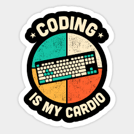

## What is Athletic programming ? 
	Many of us are asking the same thing, what exactly is Athletic Programming? Will it hurt? Does it leave us bruises and in pain? The answer is NO. Athletic Programming has some long definitions on google. To me, Athletic Programming is simply to learn by doing.

## Do I have to put on shoes to participate?
	No, you do not need shoes, or cleats, or a sweaty uniform. All you need is a couple of hours each day behind the keyboard and a positive attitude. Participating in Athletic programming can be learning about a switch statement, then implementing a switch statement that you created on your own. An exciting way is to solve a problem using what you had  just learned. . You cannot simply memorize coding interview questions nor syntax, well you can, but you will not truely be learning by doing. 

## Okay that's enough you got me, where do I sign up?
	Member fees? There are none. Getting D’s? No more son.Hurt knees? Well maybe that one if you run while programming. Anyways, you should give yourself a round of applause because Athletic Programming will change your life for the better! Athletic Programming is not just useful to programming, but you can take what you learned here and apply it to the rest of your life! This is very exciting and you should be excited also. The concepts of Athletic Programming can be applied if you are a student, teacher, father, and the list is infinite! Thank you for taking your precious time for reading my essay. 
	

	
