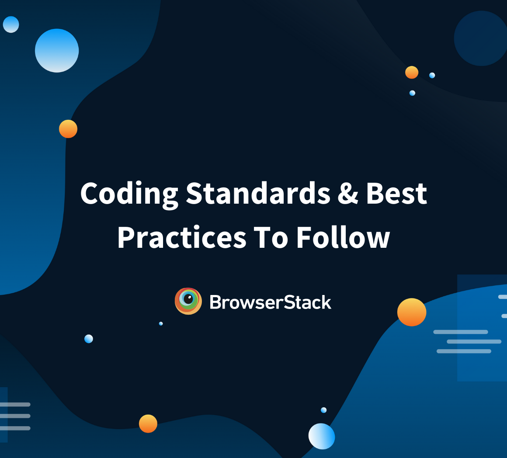
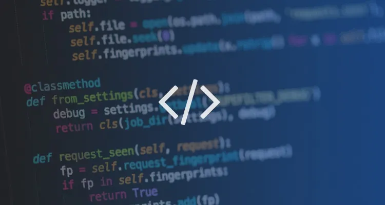

## What are Coding Standards ? 
"I didn't know coding had standards, I thought it was like burger king having it my own way ", exclaimed one of my confused classmates. 
Coding Standards are an important part of the Software Engineering Business. Coding Standards are required by many big companies like google and amazon. 
Let me take you into why we give a rats about Coding Standards. 

## Why do we care about Coding Standards ?
The best answer is because we are taking ICS 314(A good answer... but not good enough!). A better answer is because coding standards are best practices 
that top dog companies use coding standards. Not just all top dogs use them, but coding standards are good to use even when you and your friends are
working on a project. Don't forget about consisten code quality with Coding standards. Easily identifying bugs as well. Coding standards ease reading code. We all know that one friend who is a sphagetti code monster, who could really benefit from 
some coding standards. Coding standards come with a learning curve, yet once you get the gist down, it seems only natural and right. Coding Standards are 
good because they are safe and do no harm, only good. These standards kind of keep the team in line, without a supervisor watching over your back the entire
time. Coding standards is also safe because they cannot be hacked. I mean if you really wanted to steal coding standards, you really are pathetic because 
coding standards can be created by anyone for any purpose. As with Eslint and the ics coding standards, it saved me a couple times from a missed semi-colon 
or so. They are nice because they kind of act as a proof reader and can yet save you from logical errors within the code. Lets dive into where to and how 
to implement coding standards. 

## Where can I find these so called Standards?
	You can find coding standards online on the google machine. Depending on your language you may be able to import the coding standards right into your Intelli J 
  or ide. For Intelli J, there is a nice option to import the file as an xml file which will be recognized by the ide and implemented immediatly. For others, I would look around on the internet to see what you can find. Thank you for spending your time you will never get back reading my essay! 
  
h 
	
