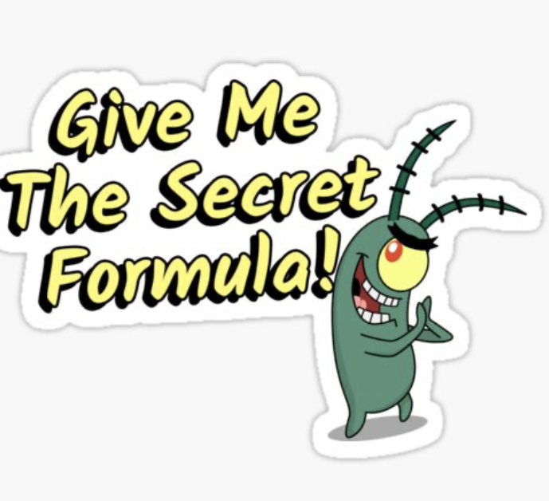
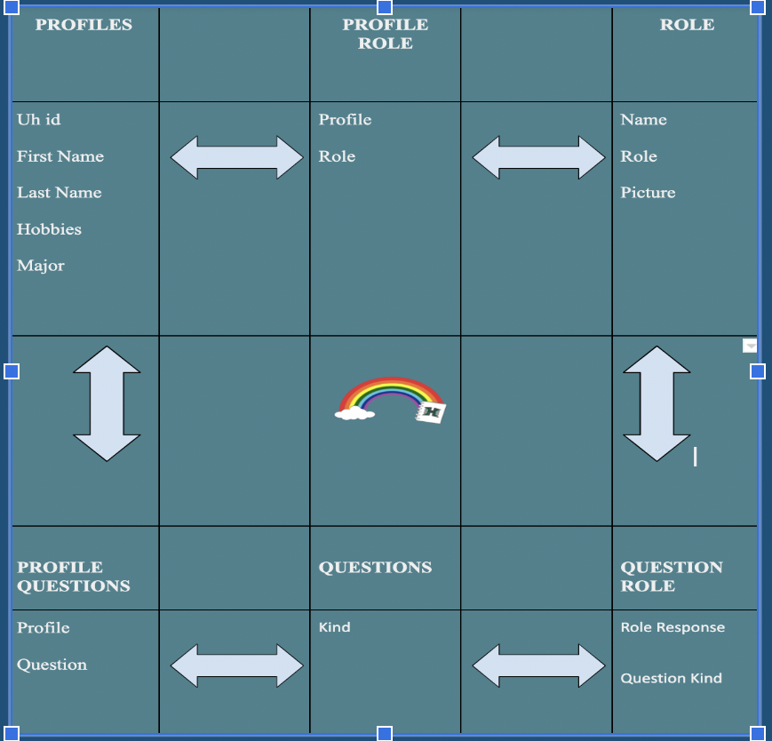

## The Secret Formula is...

I apologize in advance, I cannot give you our secret recipe right away! First please let me take you into the journey of Design Patterns.Behind every website, there is a specific design pattern the developer followed in order to get the website to “work”. Even this very page you are reading follows a unique design pattern. What else in the world follows a design pattern you may ask? Well, you may never stop asking yourself then. But don’t worry! That is why you are reading this essay. 

## At LAST THE FORMULAE is MINE!!"

At last the formula will be mine!(plankton voice) Sorry Plankton and **strange** salty man, I mean **reader**, but we have alot to discuss first. But what I can tell you is this. Behind **every** design pattern, there is a **secret** ingredient or **special** sauce that makes it so good.

What is the special **sauce** behind design patterns? What I mean by this is, what is the secret ingredient to this website that makes it operate and look the way it does? 

## One To Many Mapping

The **Design Pattern** we used for the final project was the **One to Many** mapping. Incorporating this design pattern for the Collections in our final project. Collections can be a collection of anything, people, students, types of horse radish. (not a hint for the krabby patty secret ingredient). Those **Collections** then get **linked** to other Collections to make and in the process make our work easier! **Everyone** likes easier work! An example of a collection in our project was profile. By using one to many collections, we ensured that each profile had their own sets of courses, notes, and ratings! **Courses**, **notes** and **ratings** were also collections too.  

## One To Many...When is Too Many??

For a website made by an adult, collections are **always** used! They are used on a daily basis for the world wide web. They are **everywhere**!The question comes up of when is there too may collections?Well, my answer  is not really a cap on the amount of collections that is too much for an application. This is because the application can always be expanded and more collections will only help encapsulate and make adding features easier. 

Well, thank you and I hope you liked **my** essay! 

**sorry** about the formula mr krabs!

