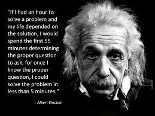
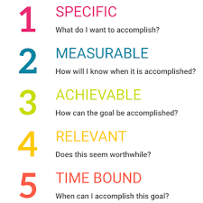

## Why Won't Anyone answer my Question?

There you are. Smell of Cookie Crumbs in the air. Happy as can be. Why? Because someone answered your question on Stack Overflow about a project you have been working on for the past two months. You open up to Stack Overflow as excited as a kid on christmas morning. But then, what happened? You start to ask yourself what is this answer? They need to know more information? They don't care that I am Newbie? I should study my own project more? Now you feel embarrassed and ashamed,and run up to your room in tears because you did not get the red ryder deluxe, you got bunny pajamas and a bowl of hurt feelings. No need to fret my friend, for I am here to get your question answered the SMART way.

## Is a SMART Question "A Thing?"

Yes, yes and YES! Professionals and engineers working in the field are using their precious, free time to answer your questions. Remind you that they are professionals that have worked for years in the software/program you are trying to run, so respect is a must as well as asking a question the correct way. In business, time is money and wasted time is wasting money. Nobody likes to waste their money. Now I present to you a SMART Question! 

In the following examples, we will see if a SMART question is being asked, or not.  

## Case Number 1

Q: How to call Python Function from Node js

 I have an Express Node.js application, but I also have a machine learning algorithm to use in Python. Is there a way I can call Python functions from my Node.js application to make use of the power of machine learning libraries?

SMART questions *do not* have to have code every single time. That is why I chose this example. Stack Overflow is also used for good old fashioned learning questions.Now Lets Analyze the question. 

**I have an Express Node.js application, but I also have a machine learning algorithm to use in Python.**

Here we see exactly what the asker is asking for. There is*no confusion or misdirection*. Clear, cut and straight to the point. He already has a Express Node.js application and is looking to intertwine with some Machine Learning. From this we can infer he has great knowledge of Node.js and is looking to learn more and just make his overall program better with the help of Machine Learning. Machine Learning can be a very complex subject, but the uses and oppurtunities to integrate it with already great programs is endless. Now, we extract the next line.

**Is there a way I can call Python functions from my Node.js application to make use of the power of machine learning libraries?**

The asker wants to implement some python functions in his Node.js application. The writer demonstrates a working knowledge of Machine Learning by exclaiming about the power of machine learning and the libraries associated with it. 

Overall, A SMART question! Good job! This writer recieved 10 solutions and was voted to be relevant and of good use. This is what happens when you take the necessary steps. Below is the link for the SMART question.

https://stackoverflow.com/questions/23450534/how-to-call-a-python-function-from-node-js

## Case Number 2.

Q: Why wont my C program work

Hi i have been writing this c program and i have hit a wall it want let me call the sleep function. When i type sleep it just sits there until i exit it. Im' writing this program as a project in school and its based off the comedy skit the dark room.

This person is attempting to get the answer for their homework problem the wrong way. Sed person could have asked can you point me in the right direction, instead of demanding an answer without knowing too much about the code in the first place. You can tell this person did not look online first or even ask a friend because of how the question is stated, it is not specific enough to be a SMART question. If the question is not SMART... if the shoe fits... just be a little more descripter with your question so it does not look like you didn't try yourself first.Doing more research is key to getting an answer from Stack Overflow. If you wanted to know, someone answered a Not so Smart Question or a Not Nice question, with a Not so Nice Answer. Now let us analyze.

Right off the bat, we can see the asker is not using correct spelling and punctuation. Let us proceed.

When i type sleep it just sits there until i exit it.

This line was not too bad, but it is not SMART enough. A SMART question needs to be very descriptive in every aspect. It just sits there until I exit it can be rewritten as, I type the sleep function in my program, which should give time for the other parts of my program to execute, but my program gets stuck somewhere forever waiting. I have to the Control Z the program to exit. 

Another important part to asking a SMART question is to learn how to debug your own code. The asker could have exclaimed that he threw a couple of printf statements to see exactly where the program was sticking to. This is important because your question reader then knows you took valuable time out of your day to try determining the problem with it, just like they are taking valuable time out of their day to answer your question. The last sentence exclaims

Im' writing this program as a project in school and its based off the comedy skit the dark room.

This tells what the reader what he is using the program for, which is a good thing for relevance purposes. BUT he says it is a project for school. You are supposed to do your own projects in school, and this question did get a response similar to that. A SMART question is not for someone to solve your Homework, but you could have asked for a hint to what was wrong with the program. 

A good thing he did was send the whole code. If you do not send the entire code, someone cannot debug your question properly. With the code being there, it can be a copy and paste job for the professional responder. All together, not a SMART question by the guidelines of SMART questions. Below is a link for this askers code in case you wanted to examine it and see why it is not a SMART question. At the top of the page there is also two arrows, this one has a -2. It says the question was not researched enough and it is not clear or useful. Ouch. Now, let us carry on to another question.

https://stackoverflow.com/questions/22468440/why-wont-my-c-program-work

## Conclusion

It is important especially when you work in the world of tech, how to ask SMART questions. This pertains to not just asking online, but asking your friends and teachers as well. Not so Smart Questions get Not so Nice Answers. Also, if you feel you are being singled out for a question asked, go through the SMART question guide to see if you Deserve a Nice Answer. We work in the world of Software, not feelings. Make sure to do your research, debug your own, use the google machine, and don't be afraid to ask a friend or ask online! Stack Overflow answerers WANT to help you, not yo make your life hard or put you down. They understand they were new at one point too, and just want to guide people to correct code because that is what they truely love doing.If you have a question I hope you take my advice and have it be SMART.! Asking questions may not always get you the best answer, but asking them in a way that will make others want to answer them will increase the success of finding a good solution and make it a positive experience on all sides.
